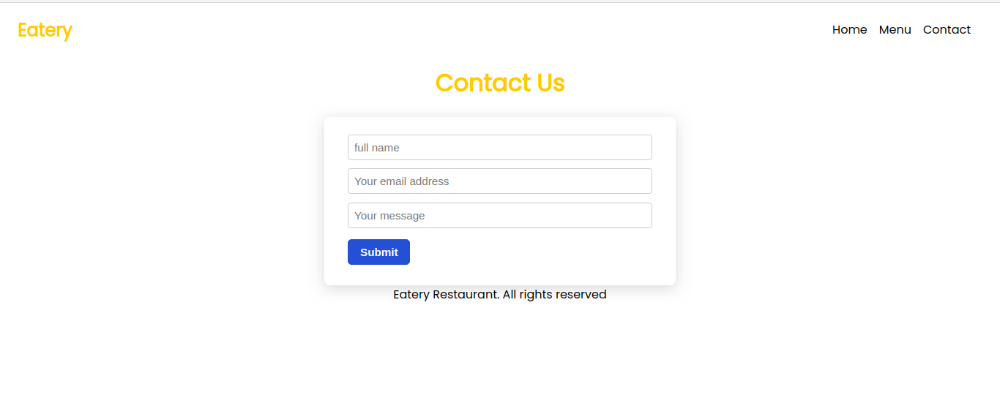

<br />
<p align="center">
  <a href="https://www.microverse.org/">
    
  </a>

  <h2 align="center">Project: Restaurant Page </h2>

  <p align="center">
    This project is part of the Microverse curriculum in Javascript module!
  </p>
</p>

## About The Project

The main goal of this project is for the student to show the understanding of the benefits of modularized code as well as the ability to set up a javascript application made of different modules using webpack.

## Screenshots


## Live Link
[Restaurant-Page](https://bit.ly/3mhNdbv)

<!-- INSTALLATION -->
## Installation

* Clone this repo ```git clone https://github.com/Mindo-Joseph/restaurant-page.git```
* Open terminal```cd``` to the cloned folder
* Checkout to the feature branch by ```git checkout feature-restaurant-page```
* Install dependencies by running ```npm i``` in your terminal
* Run webpack build by using the following command ```npm run build```
* 


### Usage

Once you have installed dependencies and run webpack build command  open ```dist/index.html``` in your browser 


### Built With

* Javascript
* Webpack

## Author


👤 **Joseph Mindo**

- Github: [@MindoJoseph](https://github.com/Mindo-Joseph)
- Twitter: [@mindoJoseph](https://twitter.com/mindoJoseph)
- Linkedin: [Joseph Mindo](https://www.linkedin.com/in/josephmindo/)


## 🤝 Contributing

Contributions, issues and feature requests are welcome!

Feel free to check the [issues page](https://github.com/Mindo-Joseph/restaurant-page/issues).


## Acknowledgments

* [Microverse](https://www.microverse.org/)


## 📝 License

This project is [MIT](lic.url) licensed.


## Show your support

Give a ⭐️ if you like this project!